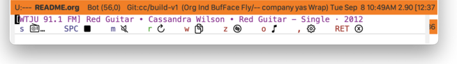

[](https://melpa.org/#/triode) [](https://stable.melpa.org/#/triode)


# triode.el



**triode.el** is a GNU Emacs remote control interface to the Triode app (<https://triode.app>), an internet radio station player for macOS.

With **triode.el**, you can control your listening to internet radio stations directly from GNU Emacs without need to change app focus.


# Requirements

**triode.el** requires the following programs and Elisp packages:

-   macOS 15+ (Sequoia)
-   [GNU Emacs](https://www.gnu.org/software/emacs/) 30.1+
-   [Transient](https://github.com/magit/transient) 0.9+
-   [Triode app](https://triode.app) for macOS 2.4+
-   [restlib](https://github.com/kickingvegas/restlib) 0.1+
-   [shazam.el](https://github.com/kickingvegas/shazam/) 1.0+


# Features

Remote control the Triode app from Emacs:

-   Choose station
-   Play/Stop toggle
-   Mute toggle
-   Copy current station and track to clipboard
-   Recognize music with Shazam
-   Open Triode app


# Install

**triode.el** is available to install from [MELPA](https://melpa.org/#/triode).

For manual installation, ensure that `triode.el` is available in the Emacs `load-path` variable.

This package requires the installation of a macOS Shortcut named “Triode RC JSON”. Download and install it in your library of Shortcuts by clicking on the link below:

-   [iCloud Shortcut: Triode RC JSON](https://www.icloud.com/shortcuts/0db0f47809fe4b0a84ac640846fd65ee)

**triode.el** by default requires your Emacs session to load the macOS SF Symbols font. Use the convenience function `triode-init` to setup both SF Symbols and to globally set your keybinding preference to the `triode-tmenu` command in your Emacs initialization file.

```elisp
(require 'triode) ;; optional if autoloaded
(triode-init "<f14>")
```

The use of the keybinding `<f14>` is merely a suggestion and can be changed to preference.


# Usage

Invoke the Transient menu `triode-tmenu` via `execute-extended-command` (`M-x`) or by your preferred keybinding.

Refer to the [triode.el User Guide](https://kickingvegas.github.io/triode/) for more details on using **triode.el**.


# Sponsorship

If you enjoy using **triode.el**, please consider buying me a coffee to help support its development and maintenance.

[](https://www.buymeacoffee.com/kickingvegas)


# Acknowledgments

Thanks to the makers of the Triode app, the Shortcuts team, and to the GNU Emacs contributors from which **triode.el** builds from. This work would not be possible without your efforts.
