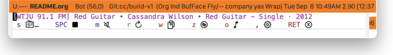

#+startup: overview nologdone
#+startup: showeverything
#+TITLE: triode.el User Guide
#+SUBTITLE: for version {{{version}}}
#+AUTHOR: Charles Y. Choi
#+EMAIL: kickingvegas@gmail.com
#+OPTIONS: ':t toc:t author:t email:t H:4 f:t
#+LANGUAGE: en
#+MACRO: version 0.0.3-rc.1
#+MACRO: kbd (eval (org-texinfo-kbd-macro $1))
#+TEXINFO_FILENAME: triode.info
#+TEXINFO_CLASS: casual
#+TEXINFO_HEADER: @syncodeindex pg cp
#+TEXINFO_HEADER: @paragraphindent none
#+TEXINFO_TITLEPAGE: t
#+TEXINFO_DIR_CATEGORY: Emacs misc features
#+TEXINFO_DIR_NAME: Triode
#+TEXINFO_DIR_DESC: An interface to the Triode app for macOS.
#+TEXINFO_PRINTED_TITLE: triode.el User Guide

Version: {{{version}}}

#+TEXINFO: Copyright © 2026 @w{Charles Y. Choi}

*triode.el* is a remote control interface to the Triode app (https://triode.app), an internet radio station player for macOS.

With *triode.el*, you can control your listening to internet radio stations directly from GNU Emacs without need to change app focus.
    
#+INCLUDE: "./sponsorship.org"

* Copying
:PROPERTIES:
:COPYING: t
:END:

Copyright © 2026 Charles Y. Choi

* Features
:PROPERTIES:
:CUSTOM_ID: features
:END:
#+CINDEX: Features

Remote control the Triode app from Emacs:

- Choose station
- Play/Stop toggle
- Mute toggle
- Copy current station and track to clipboard
- Recognize music with Shazam
- Open Triode app
  

* Requirements
:PROPERTIES:
:CUSTOM_ID: requirements
:END:
#+CINDEX: Requirements

*triode.el* requires the following programs and Elisp packages:

- macOS 15+ (Sequoia)  

- GNU Emacs 30.1+ ([[info:emacs#Top]])
  
- [[https://triode.app][Triode app]] for macOS 2.4+
  
- [[https://github.com/kickingvegas/restlib][restlib]] 0.1+
  
- [[https://github.com/kickingvegas/shazam][shazam.el]] 0.1+

* Install
:PROPERTIES:
:CUSTOM_ID: install
:END:
#+CINDEX: Install
#+VINDEX: triode-init

For manual installation, ensure that ~triode.el~ is available in the Emacs ~load-path~ variable.

This package requires the installation of a macOS Shortcut named “Triode RC JSON”. Download and install it in your library of Shortcuts by clicking on the link below:

- [[https://www.icloud.com/shortcuts/0db0f47809fe4b0a84ac640846fd65ee][iCloud Shortcut: Triode RC JSON]]

*triode.el* by default requires your Emacs session to load the macOS SF Symbols font. Use the convenience function ~triode-init~ to setup both SF Symbols and to globally set your keybinding preference to the ~triode-tmenu~ command in your Emacs initialization file.

#+begin_src elisp :lexical no
  (require 'triode) ;; optional if autoloaded
  (triode-init "<f14>")
#+end_src

The use of the keybinding {{{kbd(<f14>)}}} is merely a suggestion and can be changed to preference.

* Usage
:PROPERTIES:
:CUSTOM_ID: usage
:END:
#+CINDEX: Usage
#+VINDEX: triode-tmenu
#+VINDEX: triode-dismiss-menu-for-actions

Invoke the Transient menu ~triode-tmenu~ via ~execute-extended-command~ ({{{kbd(<f14>)}}}) or by your preferred keybinding.

#+begin_example
  M-x triode-tmenu RET
#+end_example

~triode-tmenu~ offers the following menu items

- {{{kbd(s)}}} :: Select station - open Triode app station selector to choose an internet radio station from your favorites list.
  
- {{{kbd(SPC)}}} :: Play/Stop toggle to connect or disconnect to an internet radio station.

- {{{kbd(m)}}} :: Muting toggle. This command does not disconnect an already connected internet radio station.
  
- {{{kbd(r)}}} :: Refresh Triode app state (station, current track, playback state).

- {{{kbd(w)}}} :: Copy current track to the clipboard (~kill-ring~).

- {{{kbd(z)}}} :: Open ~Shazam~ music recognition. This requires ~shazam.el~ to be installed.

- {{{kbd(o)}}} :: Open Triode app.

- {{{kbd(\,)}}} :: Open ~triode.el~ settings.

- {{{kbd(RET)}}} :: Dismiss menu.

By default, most of the commands in ~triode-tmenu~ will keep the menu displayed. This behavior can be changed with setting the customizable variable ~triode-dismiss-menu-for-actions~ to ~t~.

** Triode State Polling
#+CINDEX: Triode State Polling
#+VINDEX: triode-start-polling-status
#+VINDEX: triode-cancel-polling
#+VINDEX: triode-poll-status-interval

By default, ~triode.el~ will synchronize state between Emacs and the Triode app whenever a user action is taken. However, internet radio stations routinely can change metadata state (current track). While the Triode app can keep track of such changes, there is no capability for it to message such changes to Emacs.

A workaround is to have *triode.el* periodically poll the Triode app to synchronize state. The following commands to support this are:

- Command: triode-start-polling-status :: Start polling to synchronize Triode app state.

- Command: triode-cancel-polling :: Stop polling to synchronize Triode app state.
 
The polling period is defined by the customizable variable ~triode-poll-status-interval~ (default 200 seconds).

* Feedback & Discussion
#+CINDEX: Feedback
Please report any feedback about *triode.el* to the [[https://github.com/kickingvegas/triode/issues][issue tracker on GitHub]].

#+CINDEX: Discussion
To participate in general discussion about using *triode.el*, please join the [[https://github.com/kickingvegas/triode/discussions][discussion group]].

* Sponsorship
#+CINDEX: Sponsorship

#+INCLUDE: "./sponsorship.org"

* About
#+CINDEX: About

[[https://github.com/kickingvegas/triode][triode.el]] was conceived and crafted by Charles Y. Choi in San Francisco, California.

Thank you for using *triode.el*.

Always choose love.

* Acknowledgments
#+CINDEX: Acknowledgments

Thanks to the makers of the Triode app, the Shortcuts team, and to the GNU Emacs contributors from which *triode.el* builds from. This work would not be possible without your efforts.

* Main Index
:PROPERTIES:
:INDEX:    cp
:END:

Index for this user guide.

* Variable Index
:PROPERTIES:
:INDEX:    vr
:END:

Variables, functions, commands, and menus referenced by this user guide.
